title: A320 EFIS + FCU
author: Harry Liu
description: A complete Electronic Flight Instrument System and Flight Control Unit panel for MSFS flight simulation, based off the A320
created_at: 2025-06-13

2025-06-15:

I had no idea what to do. Apparently the Arduino Leonardo board I had was not supported by Mobiflight. My idea rn is to:

1. Watch tutorials (youtube, mobiflight documentation) and other references
2. Decide on what type of connection (PCB for structure only / soldering board thing / fully PCB)
3. Experiment with existing resources (buttons) and try to connect that to Mobiflight
4. Design a PCB, referencing existing models

I dont want to mess it up and then have it not work once I ordered.

IMAGES (forgot to insert initially, had to recall):

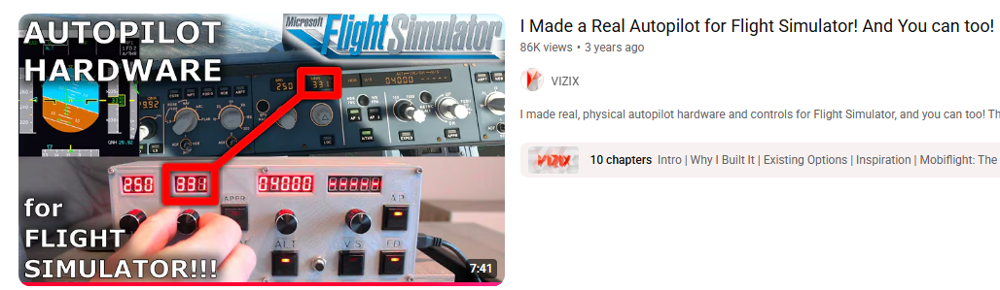
This is a tutorial that I found most helpful, some of the parts used were the exact same as mine so I was able to reference its 3d model when I couldnt find the exact dimension of parts later.

TIME:（I forgot to record time), estimate ~25 minutes

2025-06-16:

Today I downloaded Mobiflight and started referencing a button tutorial. I don't really know what to do so I'll watch some tutorials.

Time skip, its 9PM now, I think Im beginning to learn about kicad. So far chatgpt's a great helper helping my decide on what parts to use. Im just trying to find specific symbols for them. I found this really great library but some symbols weren't included. 

10 PM: I cant find the TM 1637 4 digit display symbol so I just used a generic 4 pin symbol. I currently figured out that I need to wire the ground and the 5V thing to all the displays.

IMAGES (forgot to insert initially, had to recall):

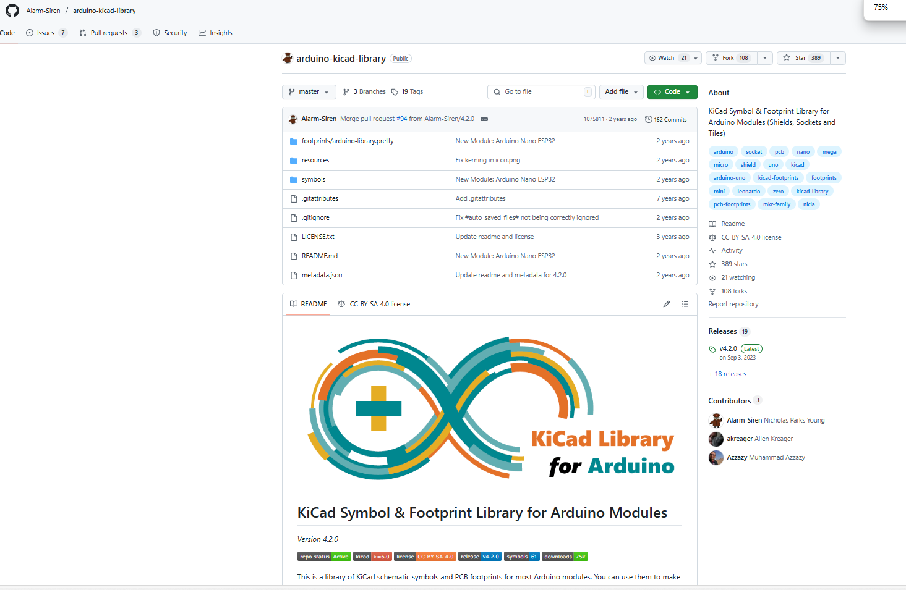
This was the library I found. It contained many kicad symbols of arduino boards. I found one with a similar sounding name as my Mega2560 Pro Micro. I verified with ChatGPT and it told me that the symbol was correct.

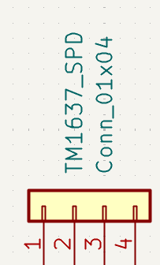
The generic 4 pin symbol. It did not allow me to change the text on the pins but ChatGPT told me which corresponded to which.

TIME:（I forgot to record time), estimate ~1 hour

2025-06-20:

Today I continued drawing the schematic, linking up all of the 4 / 6 digit displays. I also bought a board with atmega2560 which is compatiable. However, I bought a cheap version with a processor called CH340 that needed a driver. I was able to download the driver easily but spent a long time trying to get mobiflight and the arduino IDE to recognise the board. Turns out, I used the wrong cable. It worked once I switched my cable to a cooler-looking one.

IMAGES (forgot to insert initially, had to recall):

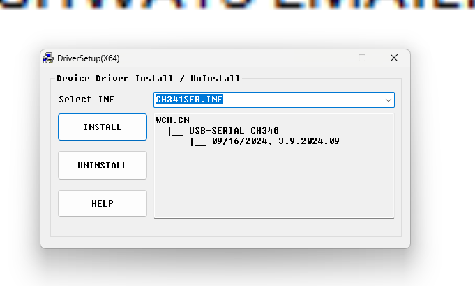
The driver installation tool. Interestingly it said that the driver was pre-installed on my machine but could not find a driver when I tried to uninstall.

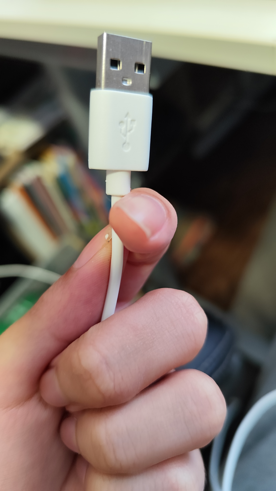
This was the cable I used. I thought that it was a driver failure and that this cable actually transmitted data due to its thickness.
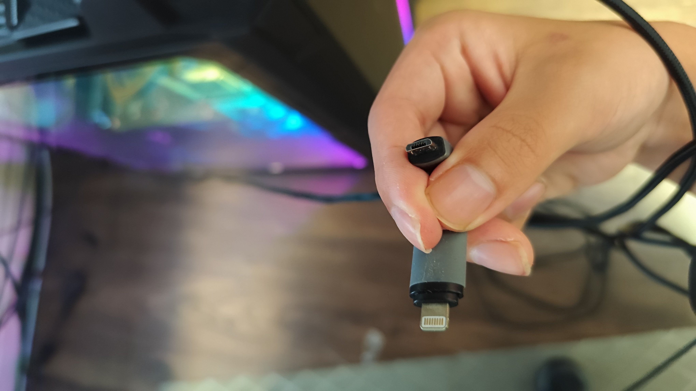
This was the cable that actually worked. Looks deceive, that's all I can say.

TIME:（I forgot to record time), estimate ~35 minutes

2025-06-21:

Drew schematics for the rotary encoders.

11:30 PM:

Finished drawing schematics! Will move onto 3D model next

IMAGES (forgot to insert initially, had to recall):

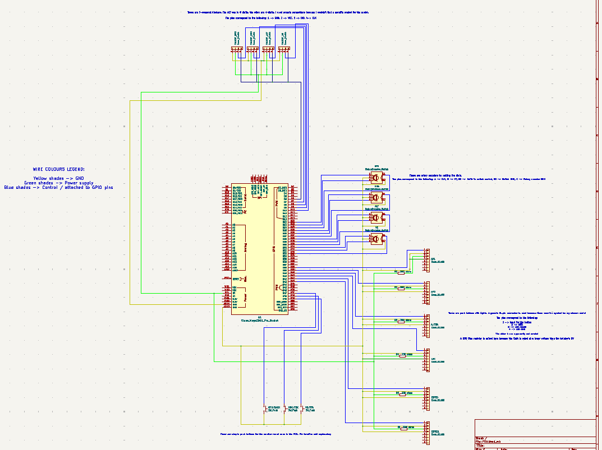
The completed schematic diagram

TIME:（I forgot to record time), estimate ~3 hours

2025-06-22：

Finished working on the front panel, need to do case next

The difficult thing (other than learning fusion) is actually to find the dimensions of the parts Im gonna use. A lot of those amazon / aliexpress sellers do not provide enough info. I did my best to track down data sheets / posts with dimensions but they may be inaccurate so I'll measure it physically after I get my parts. For now, all holes are cut according to the best info I can find.

Finished casing

IMAGES (forgot to insert initially, had to recall):

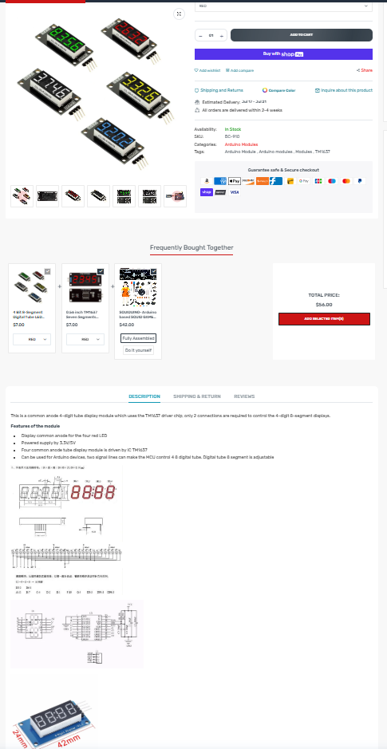
A listing of my model which contains a diagram at the bottom. However, notice how the picture near the diagram was different from the listing's picture? Signs of inconsistency like these make it difficult to guarantee the exact dimensions of parts.

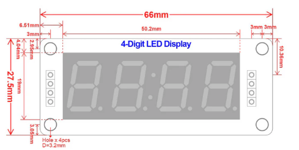
The diagram of the 4-digit display I eventually decided to trust because it showed no inconsistencies with the post.

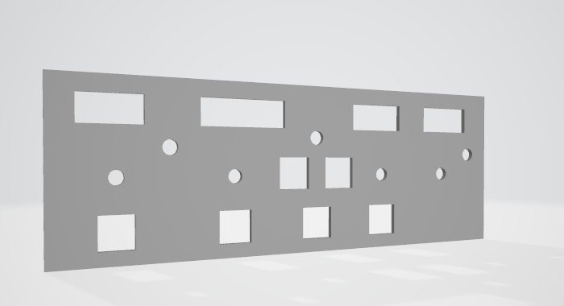
The FCU panel version at that time.

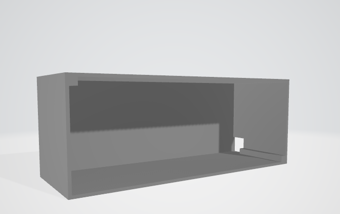
The FCU cover version at that time

TIME:（I forgot to record time), estimate ~5 hours

2025-06-23: 

Will try to use one of those tools to make my design 3D printing-friendly. 

Ended up finding that I can cut directly in fusion360. The casing is now separated into separate parts. The pillars for the screws are separated and shortened to conserve materials and printing time. I downloaded them as individual mesh files and added screw holes to the pillars which screws are to go in. The screws will be tapped after 3D printing so only a simple cylinder is needed. I plan to use m2 screws.

Crap. After putting the cover and panel together, I realised that my numbers were wrong and that there was a gap:
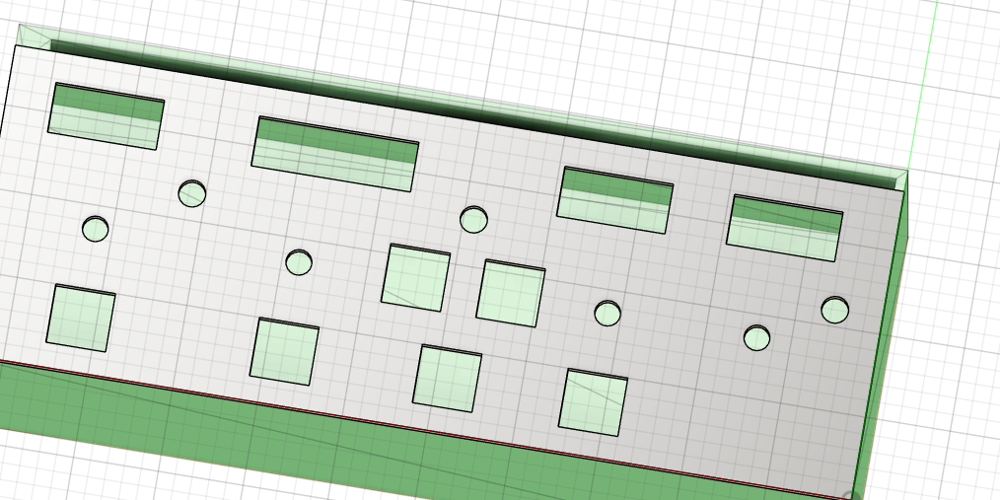 
Update: I fixed it with the pull feature.

I also added screw holes for the front panel. I think I got the math right so it should align with the screw holes in the FCU cover once assembled. Though I'm not sure if hot glue could offset the pillar and make the two holes not aligned.

IMAGES (remembered to include as part of journal from here onwards):

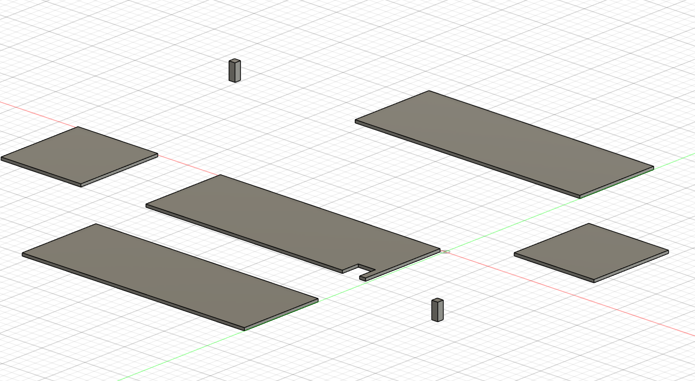
The FCU cover, now split off into separate objects

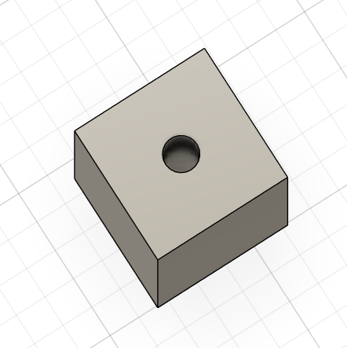
1.7mm holes are now in the trusses.

The FCU panel, now with holes for tapping in m2 screws.

TIME: (remembered to include as part of journal from here onwards): 2 hours 1 minutes

2025-06-25:

Contacted a printing legion guy in Toronto to get my parts 3D printed. It's going smooth so far. When it's done, Ill purchase a prepaid shipping label and include the shipping label cost in the BOM (at least that's what I've heard).

IMAGES:
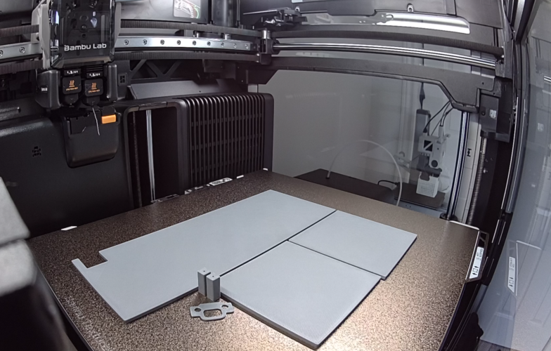
The back, left and right side walls of the FCU casing after being printed in the printer.

TIME: none.

2025-06-26

The parts are done printing. I just need to wait for the printing legion guy to provide some info so that I can buy the prepaid shipping label.

TIME: none.