title: A320 EFIS + FCU

author: Harry Liu

description: A complete Electronic Flight Instrument System and Flight Control Unit panel for MSFS flight simulation, based off the A320

created_at: 2025-06-13

-----------------------------------------------------

<h3>Total time spent so far: 12 hrs 44 min</h3>

<h2>2025-06-15:</h2>

I had no idea what to do. Apparently the Arduino Leonardo board I had was not supported by Mobiflight (A software to make hardware inputs understandable for Microsoft Flight Simulator). My idea rn is to:

1. Watch tutorials (youtube, mobiflight documentation) and other references
2. Decide on what type of connection (PCB for structure only / soldering board thing / fully PCB)
3. Experiment with existing resources (buttons) and try to connect that to Mobiflight
4. Design a PCB (Did not end up doing as I chose hidden wires instead), referencing existing models

I dont want to mess it up and then have it not work once I ordered.

<h3>IMAGES (forgot to insert initially, had to recall):</h3>

This is a tutorial that I found most helpful, some of the parts used were the exact same as mine so I was able to reference its 3d model when I couldnt find the exact dimension of parts later.

<h3>TIME:（I forgot to record time initially), estimate ~25 minutes</h3>

<h2>2025-06-16:</h2>

Today I downloaded Mobiflight and started referencing a button tutorial. I don't really know what to do so I'll watch some tutorials.

Time skip, its 9PM now, I think Im beginning to learn about kicad. So far chatgpt's a great helper helping my decide on what parts to use. Im just trying to find specific symbols for them. I found this really great library but some symbols weren't included. 

10 PM: I cant find the TM 1637 4 digit display symbol so I just used a generic 4 pin symbol. I currently figured out that I need to wire the ground and the 5V thing to all the displays.

<h3>IMAGES (forgot to insert initially, had to recall):</h3>

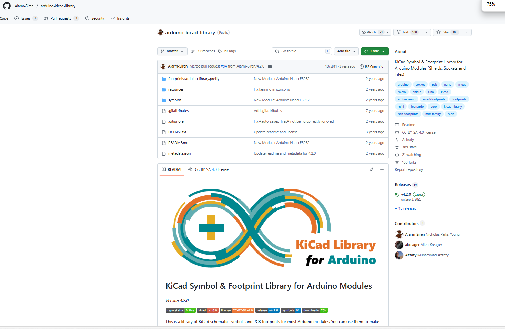
This was the library I found. It contained many kicad symbols of arduino boards. I found one with a similar sounding name as my Mega2560 Pro Micro. I verified with ChatGPT and it told me that the symbol was correct.

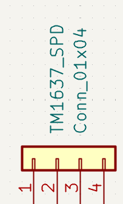
The generic 4 pin symbol. It did not allow me to change the text on the pins but ChatGPT told me which corresponded to which.

<h3>TIME:（I forgot to record time initially),</h3> estimate ~1 hour

<h2>2025-06-20:</h2>

Today I continued drawing the schematic, linking up all of the 4 / 6 digit displays. I also bought a board with atmega2560 which is compatiable (with the Mobiflight software). However, I bought a cheap version with a processor called CH340 that needed a driver. I was able to download the driver easily but spent a long time trying to get mobiflight and the arduino IDE to recognise the board. Turns out, I used the wrong cable. It worked once I switched my cable to a cooler-looking one.

<h3>IMAGES (forgot to insert initially, had to recall):</h3>

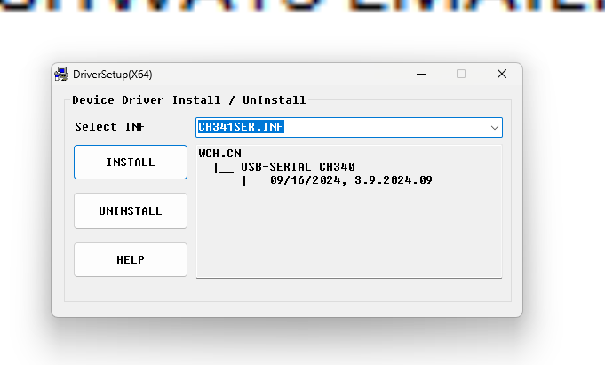
The driver installation tool. Interestingly it said that the driver was pre-installed on my machine but could not find a driver when I tried to uninstall.

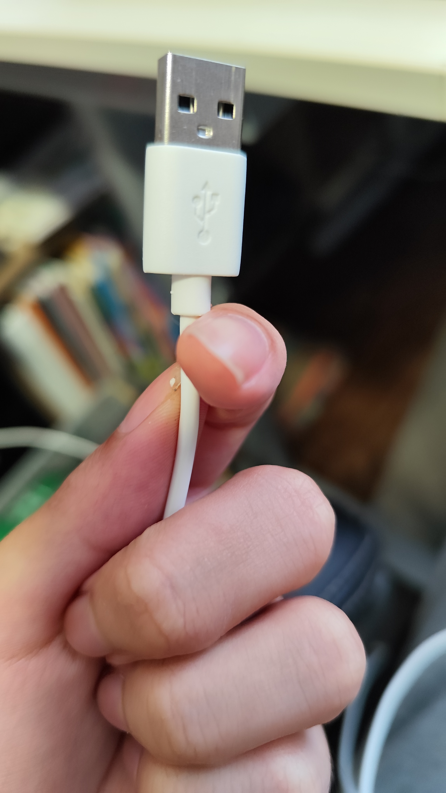
This was the cable I used. I thought that it was a driver failure and that this cable actually transmitted data due to its thickness.
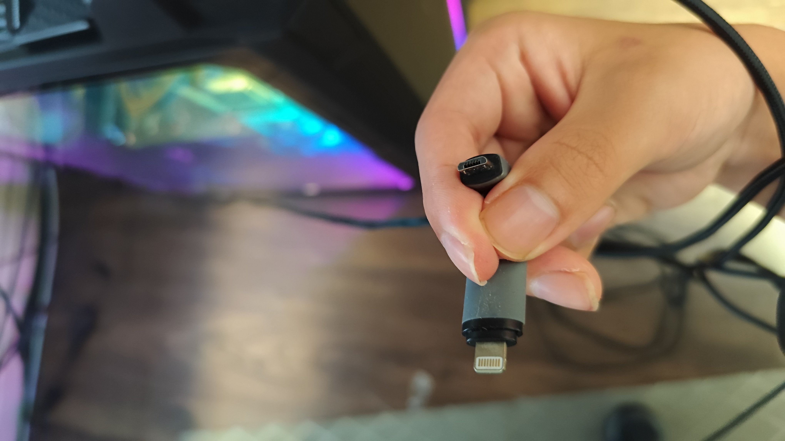
This was the cable that actually worked. Looks deceive, that's all I can say.

<h3>TIME:（I forgot to record time initially)</h3>, estimate ~35 minutes

<h2>2025-06-21:</h2>

Drew schematics for the rotary encoders.

11:30 PM:

Finished drawing schematics! Will move onto 3D model next

<h3>IMAGES (forgot to insert initially, had to recall):</h3>

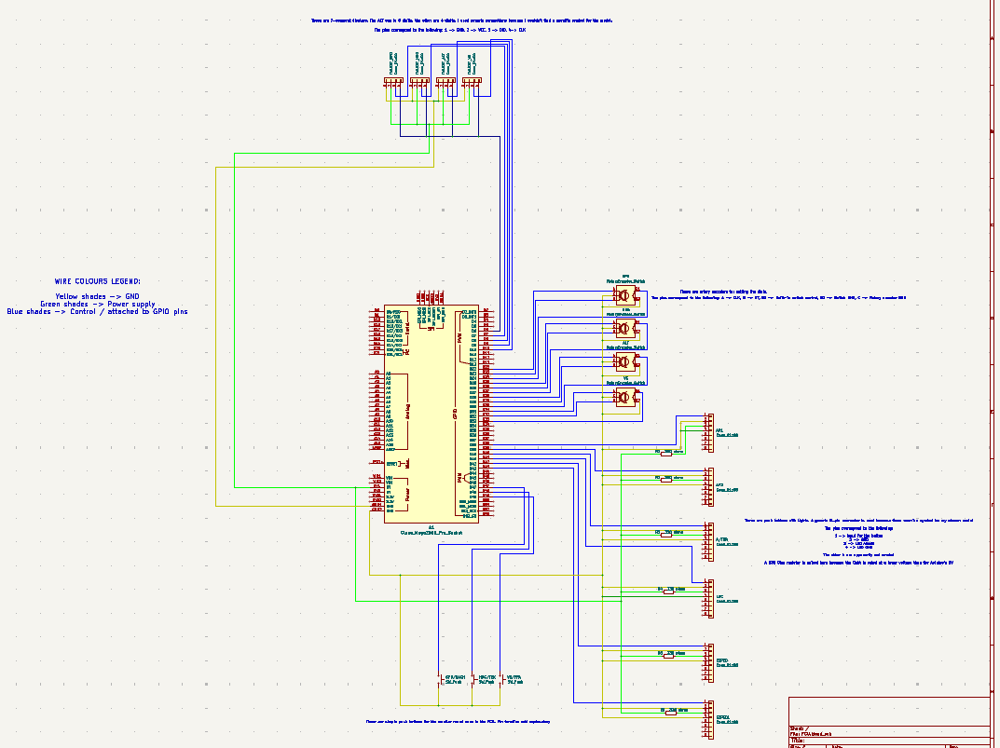
The completed schematic diagram

<h3>TIME:（I forgot to record time initially), estimate ~3 hours</h3>

<h2>2025-06-22：</h2>

Finished working on the front panel, need to do case next

The difficult thing (other than learning fusion) is actually to find the dimensions of the parts Im gonna use. A lot of those amazon / aliexpress sellers do not provide enough info. I did my best to track down data sheets / posts with dimensions but they may be inaccurate so I'll measure it physically after I get my parts. For now, all holes are cut according to the best info I can find.

Finished casing

<h3>IMAGES (forgot to insert initially, had to recall):</h3>

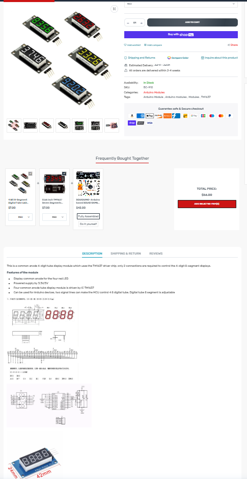
A listing of my model which contains a diagram at the bottom. However, notice how the picture near the diagram was different from the listing's picture? Signs of inconsistency like these make it difficult to guarantee the exact dimensions of parts.

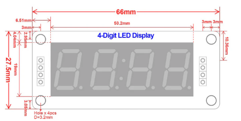
The diagram of the 4-digit display I eventually decided to trust because it showed no inconsistencies with the post.

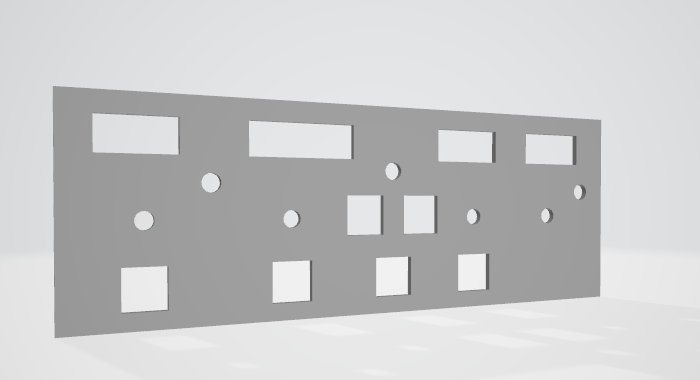
The FCU panel version at that time.

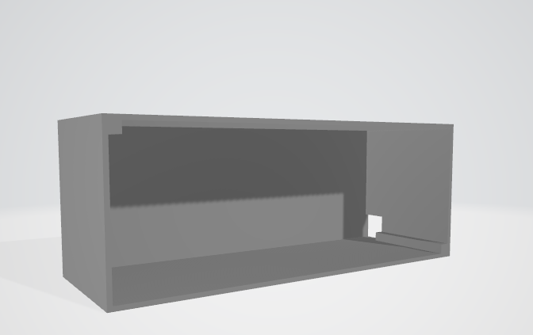
The FCU cover version at that time

<h3>TIME:（I forgot to record time initially),</h3> estimate ~5 hours

<h2>2025-06-23:</h2>

Will try to use one of those tools to make my design 3D printing-friendly. 

Ended up finding that I can cut directly in fusion360. The casing is now separated into separate parts. The pillars for the screws are separated and shortened to conserve materials and printing time. I downloaded them as individual mesh files and added screw holes to the pillars which screws are to go in. The screws will be tapped after 3D printing so only a simple cylinder is needed. I plan to use m2 screws.

Crap. After putting the cover and panel together, I realised that my numbers were wrong and that there was a gap:
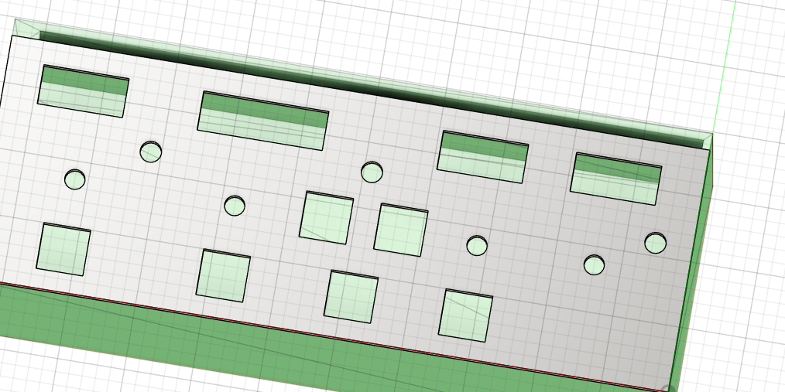 
Update: I fixed it with the pull feature.

I also added screw holes for the front panel. I think I got the math right so it should align with the screw holes in the FCU cover once assembled. Though I'm not sure if hot glue could offset the pillar and make the two holes not aligned.

<h3>IMAGES (remembered to include as part of journal from here onwards):</h3>

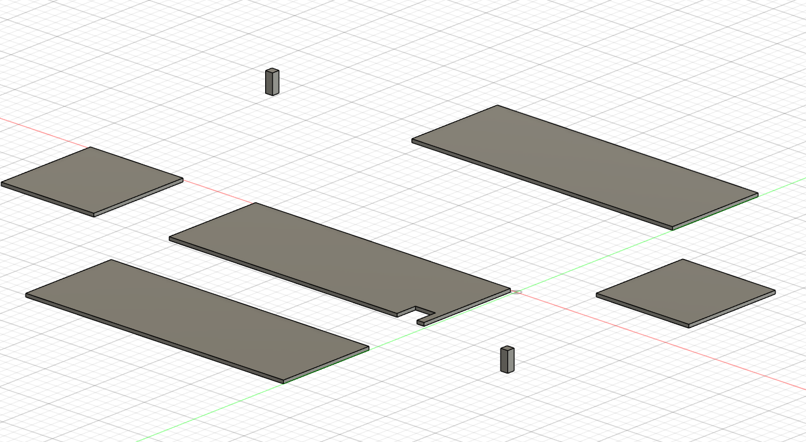
The FCU cover, now split off into separate objects

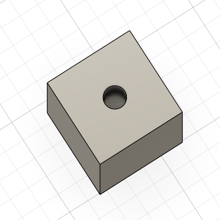
1.7mm holes are now in the trusses.

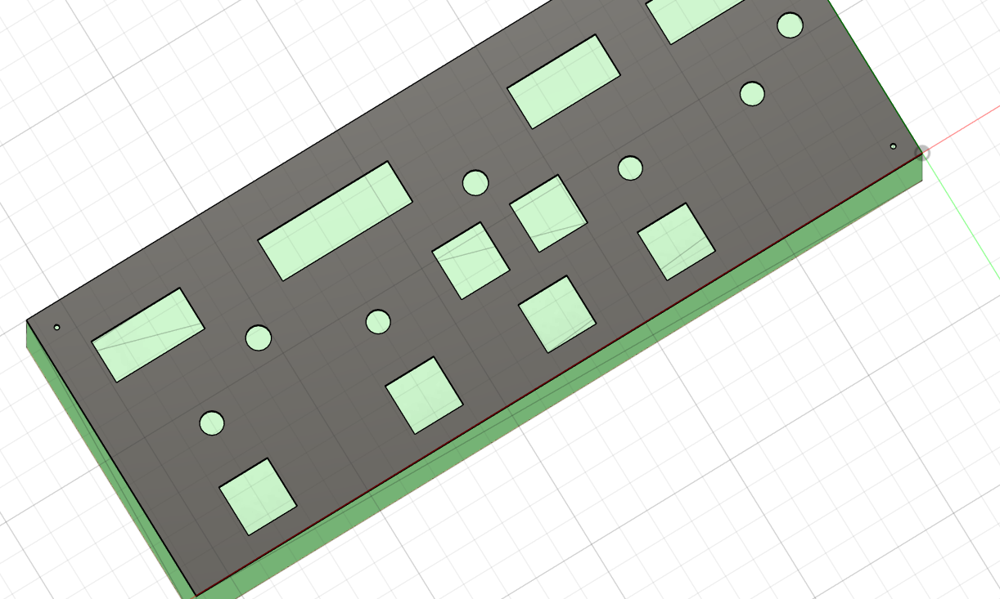
The FCU panel, now with holes for tapping in m2 screws.

<h3>TIME: (remembered to include as part of journal from here onwards): 2 hours 1 minutes</h3>

<h2>2025-06-25:</h2>

Contacted a printing legion guy in Toronto to get my parts 3D printed. It's going smooth so far. When it's done, Ill purchase a prepaid shipping label and include the shipping label cost in the BOM (at least that's what I've heard).

<h3>IMAGES:</h3>

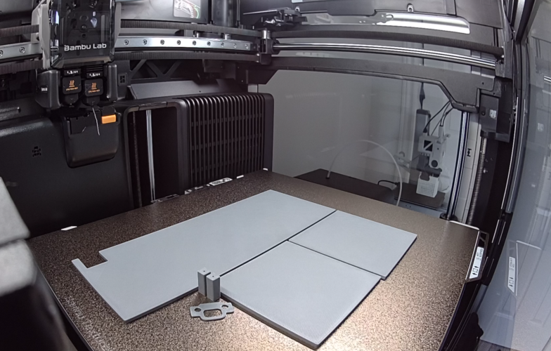
The back, left and right side walls of the FCU casing after being printed in the printer.

<h3>TIME:</h3> none.

<h2>2025-06-26</h2>

The parts are done printing. I just need to wait for the printing legion guy to provide some info so that I can buy the prepaid shipping label.

<h3>TIME:</h3> none.

<h2>2025-07-03</h2>

Horray the 3D printed parts have arrived!

<h3>TIME:</h3> none

<h2>2025-07-06</h2>

I'm actually super anxious rn, my re-review status got flipped from accepted (tenatively) to pending...

Anyways, turns out that I need electronic components in my 3D model, so I worked on a version with electronic included. You know how I complained about not finding dimensions of components for designing the 3D model? Well turns out my friend showed me this very great site with a lot of 3D models of electronic components on it. Now I can just put it in and know how large / small things need to be!

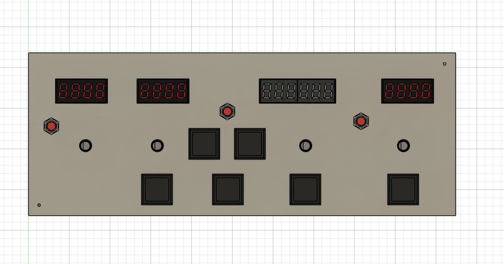

<h3>TIME:</h3> 43 minutes

<h2>2025-07-27</h2>

Okay I havent touched this project in a long time but its time to build it

Dont worry Im not soldering on the bed. Also Im in China now and my internet connection sucks, so I'd have to assemble this thing at home and then test it at an internet cafe.

Im also going to be leaving for a trip like tomorrow souuhh best of luck to me

Im current encountering an issue: I don't know which pin is what on the KD2-22 button, so I'd have to look that up, but so far Im finding absolutely nothing.

Also, it has this different type of mount so I'd have to get creative with how I attach the wires

<h2>2025-08-12, 2025-08-13</h2>

Im back from my trip, I did not complete it before my trip.

But yeah I got a bunch more wires and another soldering iron from an electronics mall because the one I had was in Canada. Unfortunately the soldering iron sucks because it has no controls at all, but that's fine.

Anyways, I spent one entire day and one entire night building this thing non-stop. Let's recap.

I've yet to check back to see if my schematic was correct or not but when building initially ChatGPT said that my KD2-22 schematics wasn't correct. Hence the reason that I need to find a reliable KD2-22 wiring guide online. So first of all during the trip I managed to find 3 different wiring schematics for the KD2-22 button.  The first one is from the YouTube video I constantly referenced when building this thing

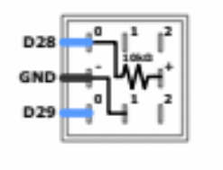

The second one was this facebook post

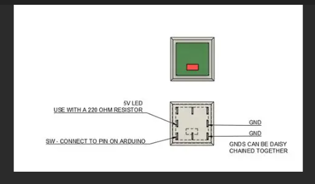

And the third one is this just plain diagram:

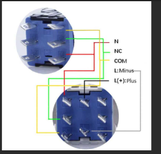

It didn't help at all that the three diagrams said completely different things. So lowkey I procrastinated on that and began to first wire up my 7 segment displays, small round buttons, and rotary encoders.

Also, another problem that I encountered (not today, earlier) was that the 6 digit TM1637 7 segment display I ordered did not fit the expected hole size (even though its CAD model did during the design process) and it had the same board design as the 4 digit ones so I thought that it couldn't possibly be scaled. Oh well I'm wrong. Because of this, I'll be leaving out the 6-digit altitude display until I can find one that fits. Though TM1637 displays work quite the same way so learning how to set it up will be no hassel.

After the rotary encoders, small black buttons, and 7 segment displays are connected, it was about noon.

Although I had absolutely no prior experiece with Mobiflight, this guy's tutorials is a saviour to me. First of all, due to my trash ahh laptop in China, I'm unable to run my MSFS 2024, so I had to purchase FSX, which I did not regret. Without this guy somehow being this clear, demonstrative, and just so happen to use FSX as well, I don't think I could've pulled it off.

But yeah I learned component by component and set the easy to connect parts in mobiflight.

Another difficulty is with the naming of Mobiflight presets. Now I think they use a tool called FSULI blah blah blah and it has a lot of codes an IDs that I cannot memorise. So I just grab named presets from Mobiflight with loaded event IDs n stuff. The problem is that they are sometimes repetitive or even outright misleading in my opinion, so you really have to keep trying over and over again for it to work, to see which one means what.

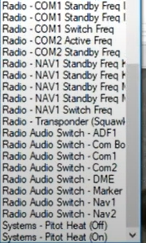

Eventually I did get the easy-to-wire stuff wired up and working on the flight simulator, but I still need to set up the KD2-22 buttons.

The problem regarding wiring the KD2-22 buttons was that it had a 2.8mm bar connector thing and silly me got 4.7mm bar connector female things at the electronics store. This means that I'd have to continue wiring the buttons via other methods since ain't no way I have time to wait for online deliveries.

The method I eventually used for soldering the buttons was to rip apart Dupont cables and the twist its copper around the pin bars of the KD2-22 and solder them together. That's exactly what I did.

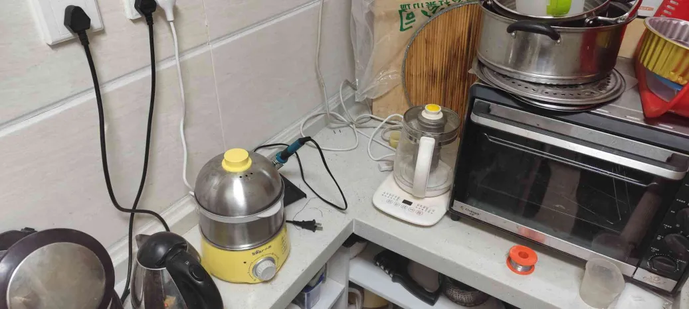
My kitchen soldering station. It smells weird in there but at least it's got the grease air sucker thing to keep the air circulating and mostly heatproof countertop. My soldering eyeglass was... none or my grandpa's sunglasses, which I lost. It's not going anywhere because I've not left the house though.

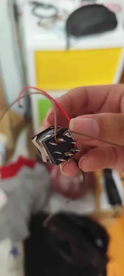
Soldered button

I decided to follow the second (Facebook) diagram since it made the most sense and was the simplist. This decision turned out to be really good as it was indeed the correct guide.

The part that actually took the longest was actually cutting up all the dupont cable, peeling it, twisting it, and soldering it. I lowkey felt like a human factory. 

The first test concluded that the switch works, but the light bulb went out after I diverted my attention to the screen for just one brief second. I went through it with chatgpt and we concluded that it may very likely be a voltage overload because as it turns out some export KD2-22 buttons are rated at much lower voltages than domestic ones that I found on Taobao.

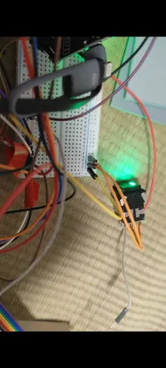
Too bright

I then added a 330 Ohm resistor, which although made it stable, did not convince me because it still shined almmost as bright in my opinion, so then I switched it to this I think 10k Ohms, but really the marker on the bag that the seller in the electronics mall had written with had faded, so I don't even know if it's 10 Ohms or 10K ohms. Anyways that didn't convince me either cuz it was about as bright if not even brighter. So I pulled up with the big guns 47K ohms resistor and it finally seemed reasonable to me.

Now I simply have to manufacture 6 more of these wired Korry buttons.

Also, the resistors + wires connections have to be manufactured as well because attaching them directly into female Dupont connectors was far too unstable and could leak electricity. So I split the Duponts into two, stripped the wire on one side, twisted it against the arm of the resistor, and soldered them together, then insulated them with electrical tape. I manufactured 6 of the as well.

I then assembled them all together.

This took about until the end of evening. I was forced to go eat some dinner before continuing work.

From then until 1 AM was basically me attaching everything together, wiring them to the board according to how I did the first KD2-22 button, following the facebook post.

Another large part of it was insulation as the electrical tapes weren't the most effective. For me to do things like this in the future, I'd consider duct tape. But there weren't any readily available to me in China for now.

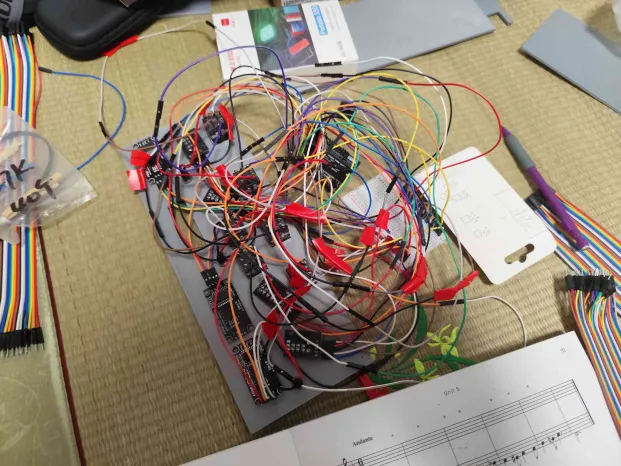
The panel after most, if not all wires are wired up.

Now, during this I've also learned that in order to make the LED programmable I actually had to connect the power source to a digital pin on the Arduino instead of just the 5V power outlet on the board. Thanks ChatGPT.

Also, because Im following a different diagram of the KD2-22 button pins, I had to abandon my old schematics when it came to the KD2-22 buttons.

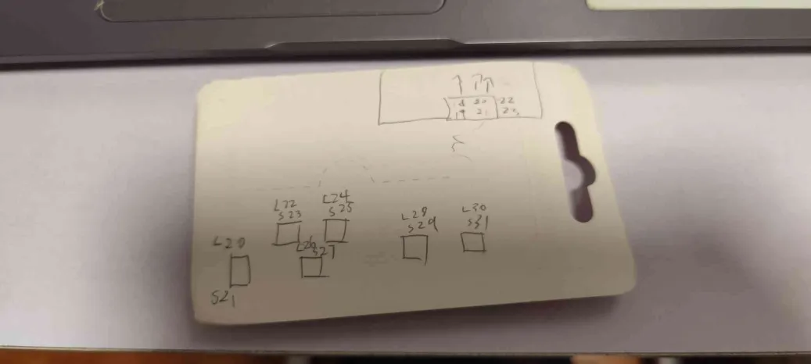
Small schematic I drew. The squares represent buttons. S represent switch connections, while L represents light connections. The little diagram on the top represents the pattern in which the pins on the Arduino go, for easier navigation when connecting pins due to most pin inks being faded from my poor soldering when soldering on the Arduino pins in Canada prior to leaving.

Anyways after that I basically finished building the aircraft profile in Mobiflight. This was kinda frusturating cuz again with the confusing preset thing I talked about, except for the autopilot panel there was no one to guide me as the joyful FSX guy did not talk about specific A321 FCU configurations for Mobiflight in FSX.

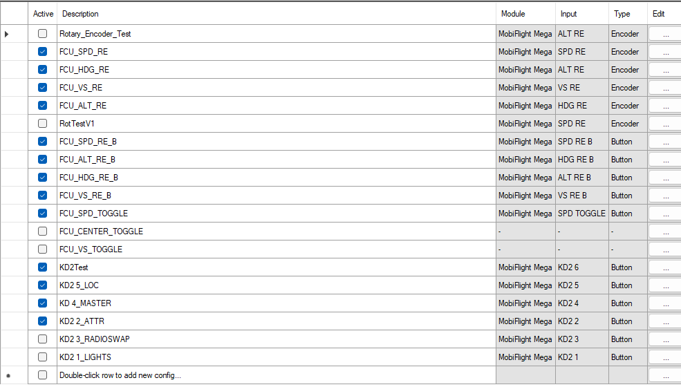
Configurations page

So that takes us to 3 AM, probably isn't the most efficient working time for those last 2 hours because it's midnight. Anyways, knowing that I'd need to take it apart in the near future to install the 6 digit display and maybe re-configuring for MSFS 2024 will need for lid to open, everything's currently hot glued together minimalistically.

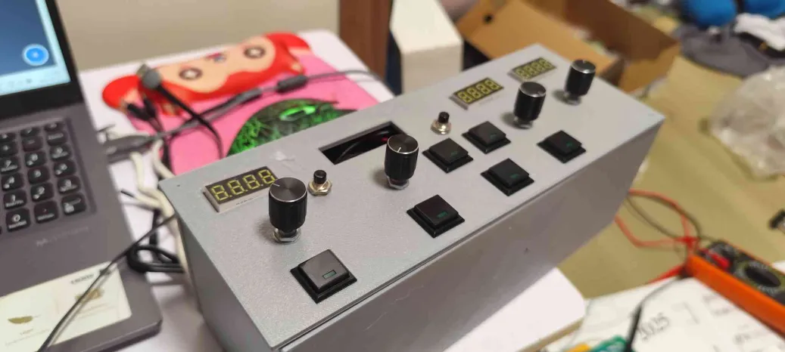

So yeah, that's done for now, we've got a working product. I'd need to disassemble to case and take the whole batch back to Vancouver. This will definitely be used in my aviation club this schoolyear. Maybe this is the first step of my home cockpit, maybe I'll be too busy so maybe not. Bye~

<h3>Active time spent: 9AM-3:45AM - unproductive times = ~14 hours and 45 minutes</h3>